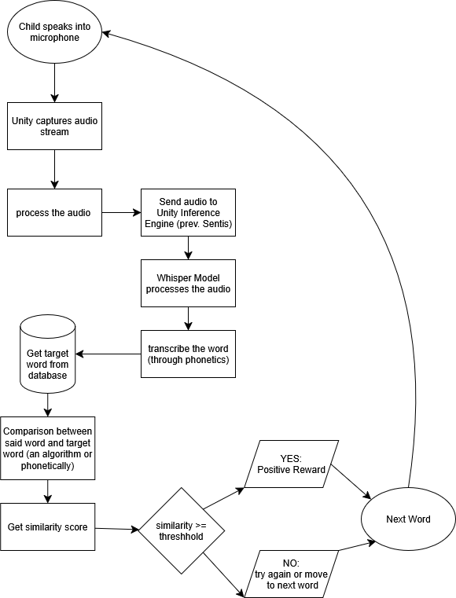

# 02-Team Repo
Template for team repo

This is my team

## Team links
- [Team Google Drive](https://drive.google.com/drive/folders/1Ac-iV2D9KQEg-vvfJxMU1BYvoQYRQEl0?usp=drive_link)

## Course links
- [ECE Senior Design Piazza Site](https://piazza.com/bu/fall2025/ec463/home)
- [Blackboard](http://learn.bu.edu/)

## Optional features links
- Team Jira
- Team Confluence
- Something else

## Project Description
Our project aims to develop an algorithm that will be used in speech therapy to compare pronunciation of words from speech therapists and the pronunciation spoken by children to help the children’s vocalizations to be more similar to the model diction.

## Project Visualization
This figure provides a high-level overview of the app’s logic and main process flow.

Figure 1: Flowchart of the app's logic

